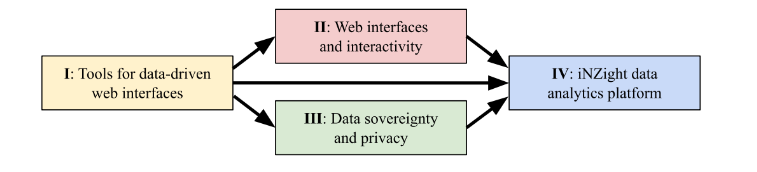
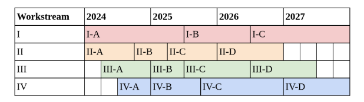

# The Future of iNZight

---

### Fellowship overview

- Ngā Puanga Pūtaiao Fellowship
- 4 Years, 4 workstreams
- End goal: rebuild iNZight

---

---

### Rebuilding iNZight (WS IV)

- A: Workshops
- B: Infrastructure design
- C: Development, feedback workshops
- D: Build + deploy

---

---

### What are your reasons for using/staying with iNZight?

---

### Why might you (or have you) consider/used something else?

---

### What features do you use?

---

### What functionality is missing?

 

### What features would you love to see?

---

### What would the "perfect" system look like?

---

# Thank you!
